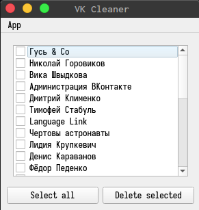

# VK Cleaner

This application allows you to clear history of all your VK
dialogs in a couple of clicks.

## Installing

1. Download or clone this repository.

2. Install Python

3. Run these commands in terminal/command line:

```text
python -m pip install -r requirements.txt
python main.py
```

Later I will also make a normal installer for Windows.

## How to use the app



1. Login to your VK account in a dialog window.

2. Enter the code sent to your device if you have two-factor authentication enabled.

3. Select all dialogs you want to delete.

4. Click on delete button.
